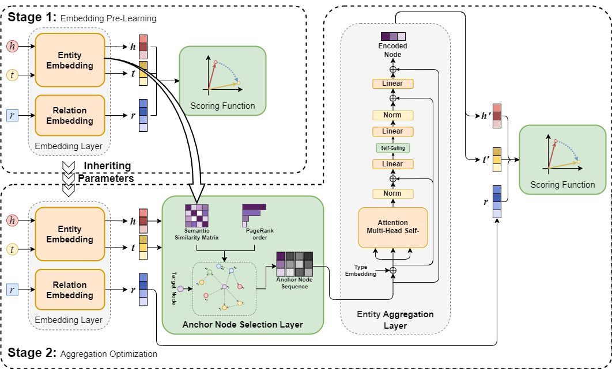

# MSAO
The code and data of "MSAO: Multi-Stage Aggregation Optimization for Knowledge Graph Embedding" ([paper](https://doi.org/10.1016/j.ipm.2025.104467))

In this paper, we propose a new KGE framework named MSAO, which decouples the aggregation optimization process from the embedding learning stage, effectively avoiding the coupling interference between them. We tested our method on 3 benchmarks and achieved complete improvement compared with Base Model. Our method is effective and generally applicable, which has the potential to be used in more powerful audio pre-trained models in the future.  

  

## Usage
1. Install the requirements from the `./requirements.txt`
2. All training commands are listed in `./best_config.sh`. For example, you can run the following two commands in sequence to train MSAO on WN18RR.
```
bash run.sh HousE_plus wn18rr 0 0 0 800 300 800 8 1 0.3 7.0 0.833655623338976 0.000648199684922278 60000 20000 8 0.0846912874864944  

bash run2.sh HousE_plus wn18rr 0,1,2,3 0 1 800 300 800 8 1 0.3 7.0 0.833655623338976 5e-4 50000 20000 4 0.0846912874864944 0.8 0.05 8 1e-5 2e-6 10
```
3. You may need to change the hyperparameters if necessary.

## Reference  
+ [https://github.com/DeepGraphLearning/KnowledgeGraphEmbedding](https://github.com/DeepGraphLearning/KnowledgeGraphEmbedding)  
+ [https://github.com/rui9812/HousE](https://github.com/rui9812/HousE)  

## Citation  
If you find this work useful, please consider citing the paper:  
```
@article{SHI2026104467, 
    author = {Bin Shi and Xuhui Zheng and Tao Fan and Hao Wang}, 
    title = {MSAO: Multi-Stage Aggregation Optimization for Knowledge Graph Embedding}, 
    journal = {Information Processing & Management}, 
    volume = {63}, 
    number = {2, Part B},
    pages = {104467},
    year = {2026},
    issn = {0306-4573}, 
    doi = {https://doi.org/10.1016/j.ipm.2025.104467},
    url = {https://www.sciencedirect.com/science/article/pii/S030645732500408X}
}
```
